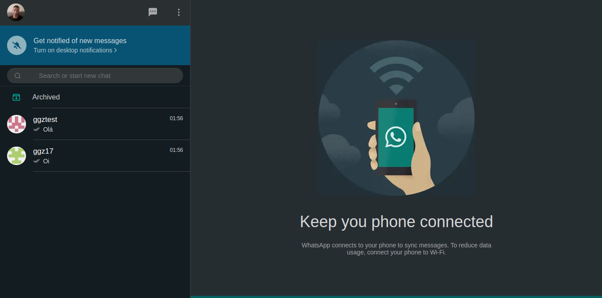

<h1 align="center">
  Whatsapp Web Clone
</h1>

<p align="center">
  
</p>

<p align="center">
  <a href="https://portfolio-garcez17.vercel.app/">Acessar site</a>
</p>

## Sobre o Projeto

Clone totalmente funcional do Whatsapp web, contendo features como envio e recebimento de mensagens, confirmação de leitura, notificações e verificação de usuário online.

Feito utilizando tecnologias como Socket.io, Next, Redux, Styled Components e MongoDB.

## Funcionalidades

- [x] Login social com Github.

- [x] Envio e recebimento de mensagens.

- [x] Notificações de recebimento de mensagem.

- [x] Confirmação de leitura.

- [x] Usuário online.

## Próximas features

- [ ] Layout responsivo.

- [ ] Login social com Google, Discord, Instagram.

- [ ] Correção de bugs de usuário online e confirmação de leitura em chats já abertos.

- [ ] Filtro de contatos.

## Feito com:
- [ReactJS](https://github.com/facebook/react) - Biblioteca Javascript para construção de interfaces.
- [Next.js](https://github.com/vercel/next.js) - Framework React JS.
- [Styled Components](https://styled-components.com/) - Biblioteca de estilização.
- [Typescript](https://github.com/microsoft/TypeScript) - Supertset para Javascript.
- [React-modal](https://github.com/reactjs/react-modal) - Biblioteca para construção de modal.
- [Redux](https://redux.js.org/) - Biblioteca de gerenciamento de estado.
- [MongoDB](https://www.mongodb.com/) - Banco de dados não relacional.
- [Socket.IO](https://socket.io/) - Biblioteca JavaScript para aplicações web em tempo real.

## Como executar

```
$ git clone https://github.com/Garcez17/whatsapp-web
$ cd whatsapp-web
$ yarn
$ yarn dev
```

## Licença

Esse projeto está sob a licença MIT. Veja o arquivo [LICENSE](https://github.com/Garcez17/Portfolio/blob/main/LICENSE) para mais detalhes.
